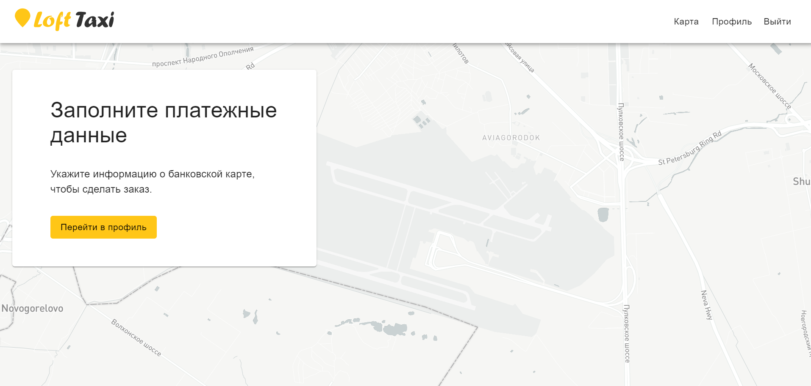
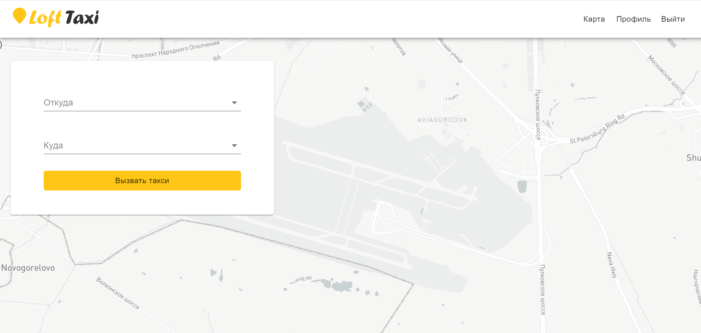
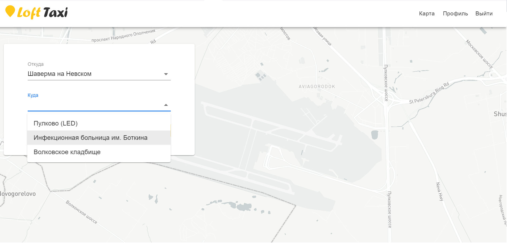
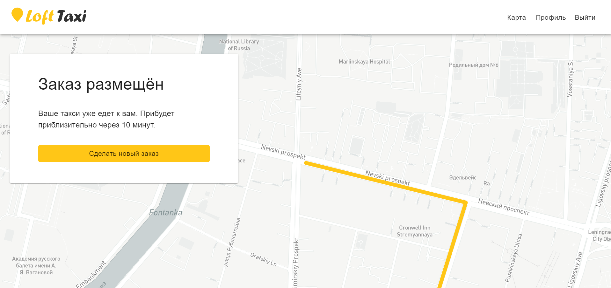

## Домашнее задание 4:

1. Настроена работа с сервером через redux-saga.

2. Добавлено получение адресов и маршрута с сервера.

3. Выполнена фильтрация списков выбираемых адресов.

4. В зависимости от заполненности профиля и сделанного заказана такси показывается соответствующие формы.

5. Реализован вход и регистрация.

## Предыдущие домашние задания:

[ДЗ №1](https://github.com/XakimAA/loft-taxi/blob/homework-1/README.md).
[ДЗ №2](https://github.com/XakimAA/loft-taxi/blob/homework-2/README.md).
[ДЗ №3](https://github.com/XakimAA/loft-taxi/blob/homework-3/README.md).

## Скриншоты:

_Данные в профиле не заполнены:_ 

_Профиль заполнен:_ 

_Фильтрация адресов:_ 

_Выполнен заказ:_ 

## Запуск

`npm intall`

Выполните перед запуском, чтобы загрузить все зависимости.

`npm start`

Приложение в режиме разработки. 
Откройте [http://localhost:3000](http://localhost:3000), чтобы просмотреть его в браузере.

`npm run build`

Собирает приложение в папке `build`.
