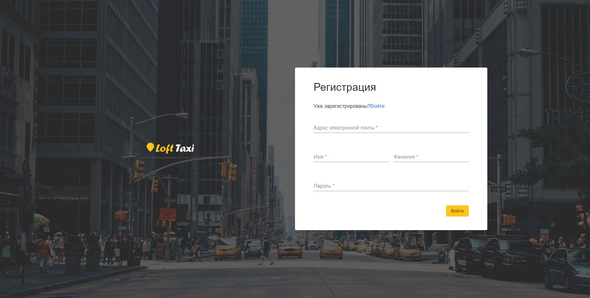
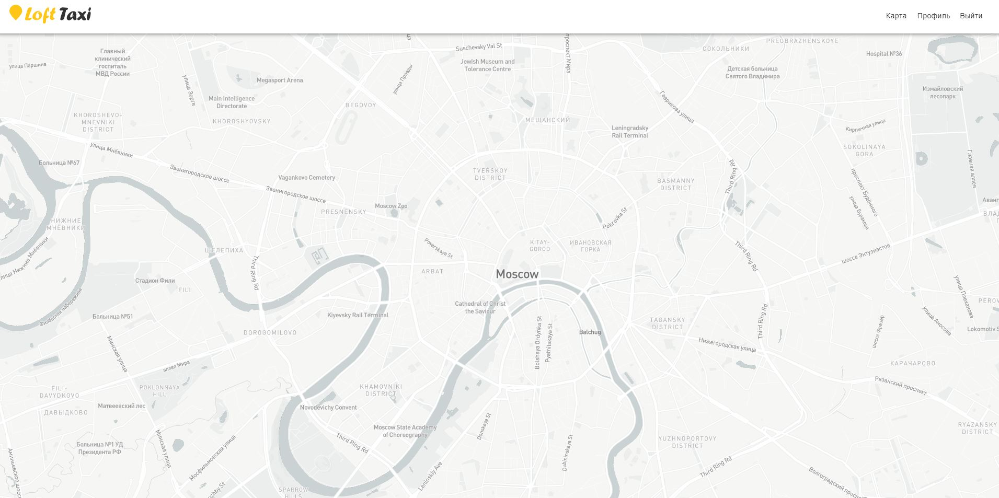
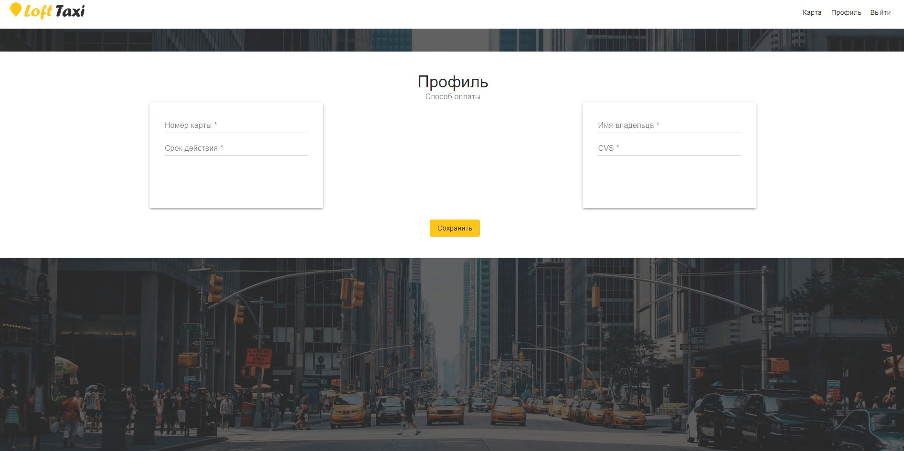

## Домашнее задание 1:

1. Cоздано приложение  при помощи [Create React App](https://github.com/facebook/create-react-app).

2. В первом приближении сверстаны страницы логина, регистрации, карты и профиля.

3. Навигация реализована при помощи стейта. При сабмите формы логина пользователь попадает на страницу с картой. 

4. Для верстки были установлены npm пакеты [material-ui](https://github.com/mui-org/material-ui) и [node-sass](https://github.com/sass/node-sass), а также тема [loft-taxi-mui-theme](https://www.npmjs.com/package/loft-taxi-mui-theme).

5. Карта сделана с помощью [mapbox](https://github.com/mapbox/mapbox-gl-js).

## Cкриншоты:

*Страница “Логин”* 

*Страница “Регистрация”* 

*Страница “Карта”* 

*Страница “Профиль”* 

## Запуск
`npm start`

Приложение в режиме разработки. 
Откройте [http://localhost:3000](http://localhost:3000), чтобы просмотреть его в браузере.

`npm run build`

Собирает приложение в папке `build`.